# Overview

This is a demo application to show how service lifetimes works in Asp.Net Core default dependency injection. You can find the [related blog post here](https://www.mycodeinfo.com/blog/service-lifetimes-in-asp-net-core-dependency-injection/).

# What are service lifetime scopes?

You can use three lifetimes with the default dependency injection framework. These lifetimes affect how the service is resolved and disposed of by the service provider.

1. **Transient:** A new service instance is created each time a service is requested from the service provider. If the service is disposable, the service scope will monitor all instances of the service and destroy every instance of the service created in that scope when the service scope is disposed.
2. **Singleton:** Only one instance of the service is created if it's not already registered as an instance. Single instance services are tracked by the root scope if they are created by the framework. This means that single instance services will not be disposed until the root scope is disposed which is usually occur when the application exits. Please note that if your singleton service is disposable and you didn't register it with its implemented type or service provider factory and registered it as an instance, framework does not track and dispose it. In this case you should manually dispose it after the service container is disposed. 
3. **Scoped:** A new instance of a service is created in each scope. It will act as if it is singleton within that scope. If the service is disposable it will be disposed when service scope is disposed.

# How do Service Scopes track disposable services?

In Asp.Net Core a new service scope will be created at each request and will be disposed when request ended with a response or an exception.

When...

* A **scoped** service is requested;
  * Service scope will create an instance of the service that has not been already created in the service scope. 
  * Service scope will always track scoped services.
* A **transient** is requested; 
  * Service scope will always create an instance of the service within the service scope.
  * Service scope will track only disposable transient services.
* A **singleton** service is requested;
  * If the service does not have any instances, the root scope creates an instance of the service. 
  * Root scope will always track the singleton service. 